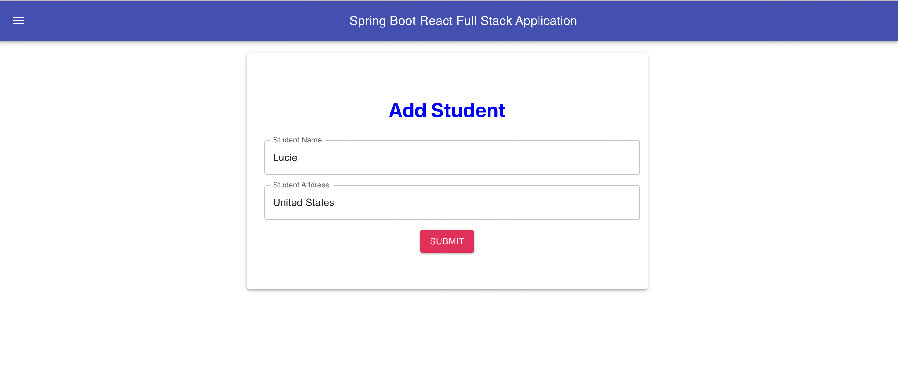
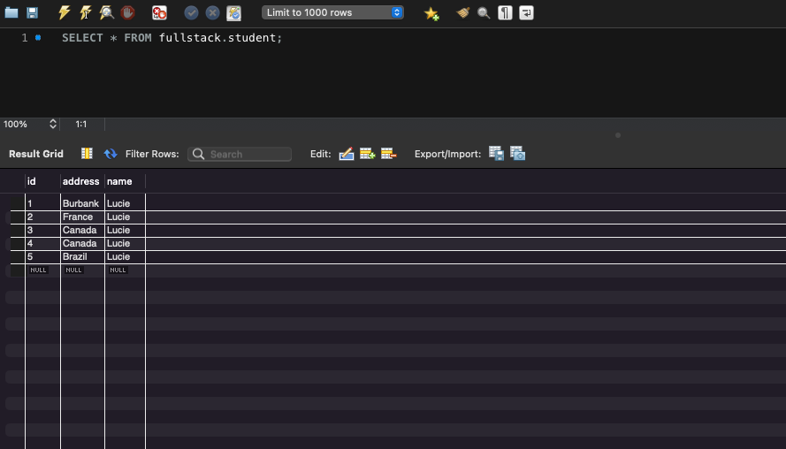

# Spring Backend and React Frontend
## Test No. 1

## Key Features:
- Material UI icons and components
- Spring Boot backend
- SQL database
- React App frontend web pages
- Create students with app

## Tools:
- MySQLWorkbench
- VS Code
- IntelliJ
- Postman Web (testing)
- Spring initializr
- Material UI

## Tutorial:
https://www.youtube.com/watch?v=O_XL9oQ1_To

## Images:

